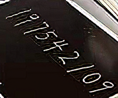

## 结果

原图链接: [https://arxiv.org/pdf/1609.04802v5.pdf](https://arxiv.org/pdf/1609.04802v5.pdf)

以下是各个数据集在本次超分重建算法中得到的PSNR以及SSIM平均结果的可视化展示

```bash
本次所用神经网络整体结构图如下：
```
<span align="center"></span>

| Set14 | Scale |   SRResNet   |    SRGAN     |
|:----:|:-----:|:------------:|:------------:|
| PSNR |   4   | (**28.05**)  | (**27.43**)  |
| SSIM |   4   | (**0.8212**) | (**0.8060**) |

| Set14 | Scale |   SRResNet   |    SRGAN     |
|:-----:|:-----:|:------------:|:------------:|
| PSNR  |   4   | (**28.57**)  | (**27.12**)  |
| SSIM  |   4   | (**0.7815**) | (**0.7321**) |

```text
Set14数据集上的效果展示：
```
Input: 

<span align="center"></span>
<span align="center"></span>
<span align="center"></span>
<span align="center"></span>
<span align="center"></span>

Output: 

<span align="center"></span>
<span align="center"></span>
<span align="center"></span>
<span align="center"></span>
<span align="center"></span>

`此处为与SRResNet的生成图像做对比：`

<span align="center"></span>
<span align="center"></span>
<span align="center"></span>
<span align="center"></span>
<span align="center"></span>
```text
此处可以与SRCNN的生成图像再做个对比：
```
<span align="center"></span>
<span align="center"></span>
<span align="center"></span>
<span align="center"></span>
<span align="center"></span>
```text
可以看出，作为经典的超分重建算法的SRCNN，在原比例超分重建下得到的效果还是很令人满意的。不过这不是本次实验探讨重点。
本次实验研究的是在对图像大小进行压缩处理后的超分重建。
```
```text
因此，我们现在来对比在局部放大的图像上，SRCNN与SRGAN算法的优劣性：(左侧是本次实验原图，右侧为重建后图像。)
```
<span align="center"></span>
`SRCNN效果图：`
<span align="center"></span>
`SRGAN效果图：`
<span align="center"></span>
```text
由以上几张图片可以明显看出，SRGAN算法在高倍放大图像的超分重建方面表现更为出色！
```
```bash
Set14数据集部分效果展示：
```
Input:

<span align="center"></span>
<span align="center"></span>
<span align="center"></span>
<span align="center"></span>
<span align="center"></span>
```text
以下为SRResNet的重建效果：
```
<span align="center"></span>
<span align="center"></span>
<span align="center"></span>
<span align="center"></span>
<span align="center"></span>
```text
再来看下SRGAN的重建效果：
```
<span align="center"></span>
<span align="center"></span>
<span align="center"></span>
<span align="center"></span>
<span align="center"></span>
```text
效果很棒！！🌼🌼
```